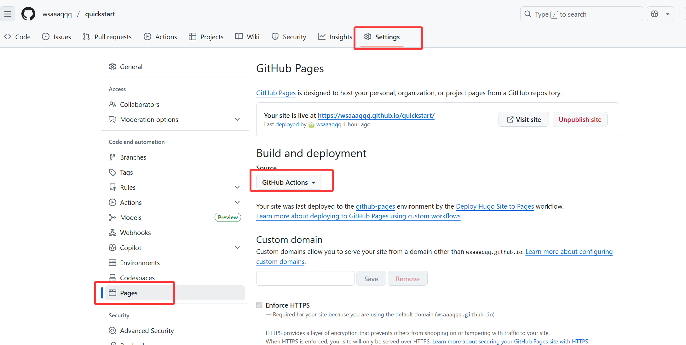

+++
date = '2025-10-12T11:27:36+08:00'
draft = false
title = '自动部署'
weight = 1
+++

开启github 提交自动部署

创建自动部署配置文件： 
`.github/workflows/deploy.yml`

~~~yaml
name: Deploy Hugo Site to Pages

on:
  push:
    branches: ["main"]   # 代码推送至 main 分支时触发
  workflow_dispatch:     # 支持手动触发

permissions:
  contents: read
  pages: write
  id-token: write

concurrency:
  group: "pages"
  cancel-in-progress: false

jobs:
  build:
    runs-on: ubuntu-latest
    steps:
      - name: Checkout code
        uses: actions/checkout@v4
        with:
          submodules: recursive  # 自动拉取主题子模块
          fetch-depth: 0

      - name: Setup Hugo
        uses: peaceiris/actions-hugo@v2
        with:
          hugo-version: 'latest'
          # extended: true       # 若主题需扩展版，取消注释

      - name: Build with Hugo
        run: hugo --minify --gc   # 生成优化后的静态文件

      - name: Upload artifact
        uses: actions/upload-pages-artifact@v3
        with:
          path: ./public          # 上传生成的站点文件

  deploy:
    environment:
      name: github-pages
      url: ${{ steps.deployment.outputs.page_url }}
    runs-on: ubuntu-latest
    needs: build
    steps:
      - name: Deploy to GitHub Pages
        id: deployment
        uses: actions/deploy-pages@v4

~~~
